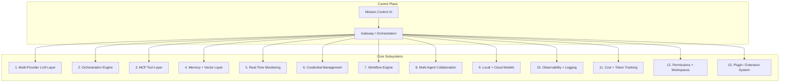

# 00 — Overview

## Vision

AI Mission Control is a **control plane for autonomous and assisted AI work**. It lets a single operator (or a team) connect any LLM provider, define agents with tools and memory, chat with them, assign tasks, chain them into workflows, and watch everything — tokens, cost, latency, errors, and infrastructure — from one dark-mode "mission control" surface.

The mental model: **agents are workers, the platform is the operations center.** Like Palantir/Tesla mission control, the operator sees live state at a glance and can drill into any unit.

## Design principles

1. **Provider-agnostic.** Nothing in the agent/orchestration layer knows which vendor is behind a model. Adding a provider is one adapter, zero changes elsewhere.
2. **Event-driven core.** State changes are events. The UI, logging, and cost layers are all subscribers. This makes real-time monitoring and audit a natural consequence, not a bolt-on.
3. **Everything is observable.** Every model call, tool call, and agent transition emits a structured trace + usage event. No silent work.
4. **Secure by default.** Credentials are encrypted at rest, scoped to a workspace, and never returned to the client. Tools run with least privilege.
5. **Stateless services, durable state.** App services scale horizontally; all durable state lives in Postgres/Redis/Qdrant/object storage.
6. **Composable, not monolithic.** Capabilities are packages with clear contracts. The TradingView MCP is just one connector.
7. **Human-in-the-loop where it matters.** Agents can be gated on approvals for high-risk actions (spend, external writes, trades).

## The 13 subsystems

| # | Subsystem | Home | Detail |
|---|-----------|------|--------|
| 1 | Multi-Provider LLM Layer | `packages/providers` | [05](./05-provider-abstraction.md) |
| 2 | Orchestration Engine | `packages/agent-core` | [07](./07-orchestration-multiagent.md) |
| 3 | MCP Tool Layer | `packages/mcp-connectors` | [08](./08-mcp-integration.md) |
| 4 | Memory + Vector Layer | `apps/rag` + `packages/db` | [10](./10-memory-rag.md) |
| 5 | Real-Time Monitoring | `apps/gateway` (WS/SSE) | [09](./09-streaming-websockets.md), [11](./11-observability-cost.md) |
| 6 | Credential Management | `packages/db` + gateway KMS | [13](./13-security-deployment-scaling.md#secrets) |
| 7 | Workflow Engine | `packages/agent-core` | [07](./07-orchestration-multiagent.md#workflows) |
| 8 | Multi-Agent Collaboration | `packages/agent-core` | [07](./07-orchestration-multiagent.md#multi-agent) |
| 9 | Local + Cloud Models | `packages/providers` (Ollama adapter) | [05](./05-provider-abstraction.md) |
| 10 | Observability + Logging | OpenTelemetry + `usage_events` | [11](./11-observability-cost.md) |
| 11 | Cost + Token Tracking | `packages/providers` + `usage_events` | [11](./11-observability-cost.md#token--cost-accounting) |
| 12 | Permissions + Workspaces | Clerk + `packages/db` RBAC | [13](./13-security-deployment-scaling.md#rbac) |
| 13 | Plugin / Extension System | MCP + provider adapter contracts | [08](./08-mcp-integration.md#extensibility) |

## How the existing TradingView MCP fits

The current repo (`src/core`, `src/tools`, `src/cli`) is a working MCP server that controls TradingView Desktop over CDP. In the platform it becomes **`packages/tradingview-mcp`** — a registered MCP connector. A "Trading Agent" can then call its tools (`chart_get_state`, `data_get_ohlcv`, `replay_trade`, …) like any other tool. It grounds the abstractions: if the connector model works for TradingView's 68 tools, it works for Slack/GitHub/Notion.

## Glossary

- **Provider** — a vendor/runtime serving models (OpenAI, Ollama, …).
- **Model** — a specific model id under a provider (`gpt-4o`, `claude-opus-4-8`, `llama3.1:70b`).
- **Agent** — a configured worker: system prompt + model + tools + memory + settings.
- **Run** — one execution of an agent (or workflow), producing messages, tool calls, traces, usage.
- **Connector** — an MCP server the platform talks to, exposing tools/resources.
- **Workflow** — a graph of agent/tool steps with triggers, edges, and conditions.
- **Usage event** — a normalized record of tokens + cost for a single model call.
- **Workspace** — a tenant boundary; owns agents, credentials, members, and data.
