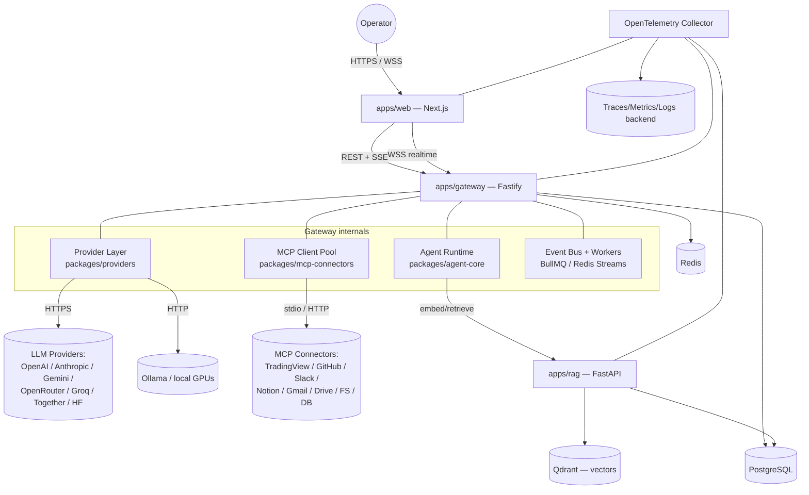
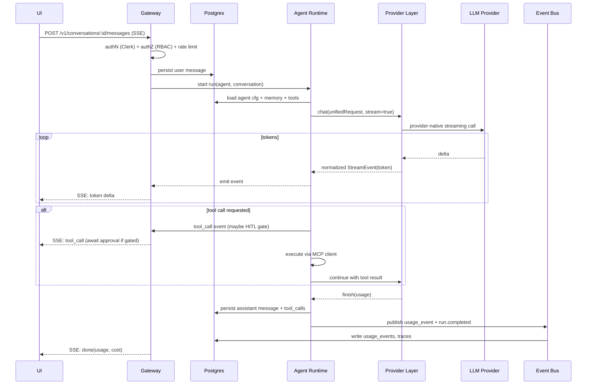
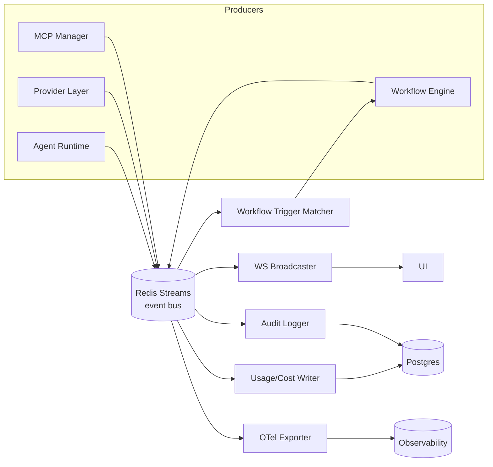

# 01 — System Architecture

## Runtime topology (C4 container view)



## Layered view

```mermaid
flowchart LR
  subgraph L1[Presentation]
    A[Mission Control UI]
  end
  subgraph L2[Application / Gateway]
    B[REST API]
    C[Realtime: SSE + WS]
    D[Auth + RBAC middleware]
    E[Rate limit + idempotency]
  end
  subgraph L3[Domain]
    F[Agent Runtime + Orchestrator]
    G[Workflow Engine]
    H[Provider Abstraction]
    I[MCP Connector Manager]
    J[Memory/RAG client]
  end
  subgraph L4[Infrastructure]
    K[(Postgres)]
    M[(Redis)]
    N[(Qdrant)]
    O[(Object storage)]
    P[(LLM/MCP externals)]
  end
  L1-->L2-->L3-->L4
```



## Request flow — "chat with an agent" (happy path)



## Event-driven core

Everything meaningful is an event published to **Redis Streams** (durable, replayable) and fanned out:

- **Producers:** agent runtime, workflow engine, provider layer, MCP manager.
- **Consumers:** WebSocket broadcaster (live UI), usage/cost writer, OTel trace exporter, audit logger, workflow trigger matcher.



### Canonical event envelope

```jsonc
{
  "id": "evt_01H...",            // ULID
  "type": "run.token",          // dot-namespaced, versioned via schema registry
  "ts": "2026-05-29T12:00:00Z",
  "workspaceId": "ws_...",
  "actor": { "kind": "agent", "id": "agt_..." },
  "subject": { "kind": "run", "id": "run_..." },
  "traceId": "...",             // ties to OpenTelemetry span
  "data": { /* type-specific payload */ }
}
```

Core event types: `run.started`, `run.token`, `run.tool_call`, `run.tool_result`, `run.awaiting_approval`, `run.completed`, `run.failed`, `agent.status_changed`, `workflow.step_started/completed`, `usage.recorded`, `connector.health_changed`, `provider.health_changed`.

## Concurrency & scaling stance

- **Gateway** and **web** are stateless → scale by replica count behind a load balancer.
- **Realtime fan-out** survives multi-replica because the WS broadcaster subscribes to the shared Redis Streams bus (any replica can serve any socket; sticky sessions optional, not required).
- **Heavy/long work** (full workflow runs, batch jobs, RAG ingest) runs in **BullMQ workers**, not request handlers, so request latency stays bounded.
- **Durable state only in backing stores** — no in-process session affinity required for correctness. See [13 — Scaling](./13-security-deployment-scaling.md#scaling).
