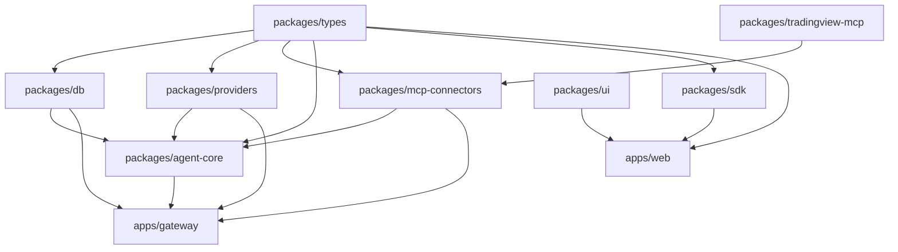

# 02 — Monorepo Structure

Tooling: **pnpm workspaces + Turborepo**. All TypeScript packages share a root `tsconfig` base and ESLint/Prettier config. The Python service (`apps/rag`) is managed with `uv`/`poetry` and excluded from the JS workspace.

## Folder tree

```
mission-control/                 # (monorepo root; this repo evolves into it)
├─ apps/
│  ├─ web/                       # Next.js 15 App Router dashboard
│  │  ├─ app/                    # routes: /, /agents, /chat, /workflows, /obs, /infra, /kb
│  │  ├─ components/             # feature components (compose packages/ui)
│  │  ├─ lib/                    # client SDK wiring, hooks (useStream, useRealtime)
│  │  └─ styles/
│  ├─ gateway/                   # Fastify orchestration service
│  │  ├─ src/
│  │  │  ├─ routes/              # REST + SSE handlers (thin)
│  │  │  ├─ realtime/            # WS server + Redis Streams broadcaster
│  │  │  ├─ workers/             # BullMQ processors (runs, workflows, ingest)
│  │  │  ├─ middleware/          # auth, rbac, rate-limit, idempotency
│  │  │  └─ bootstrap.ts
│  │  └─ Dockerfile
│  └─ rag/                       # FastAPI embeddings + retrieval (optional phase)
│     ├─ app/
│     │  ├─ routers/             # /embed, /ingest, /retrieve
│     │  ├─ pipelines/           # chunking, embedding, reranking
│     │  └─ clients/             # qdrant, postgres
│     └─ Dockerfile
├─ packages/
│  ├─ types/                     # shared zod schemas + inferred TS types (single source of truth)
│  ├─ providers/                 # provider abstraction layer + adapters
│  │  └─ src/adapters/{openai,anthropic,google,ollama,openrouter,groq,together,huggingface}.ts
│  ├─ agent-core/                # agent lifecycle, orchestrator, workflow engine, router
│  ├─ mcp-connectors/            # MCP client framework + connector registry
│  ├─ db/                        # Drizzle schema, migrations, typed client, repositories
│  ├─ sdk/                       # typed client SDK (used by apps/web), generated from types
│  ├─ ui/                        # shadcn component library + design tokens + Framer primitives
│  └─ tradingview-mcp/           # existing TV MCP, repackaged (src/core + src/tools + src/cli)
├─ infra/
│  ├─ docker/                    # docker-compose for local (pg, redis, qdrant, ollama)
│  ├─ k8s/                       # Helm chart / manifests
│  └─ otel/                      # collector config
├─ docs/mission-control/         # this blueprint
├─ turbo.json
├─ pnpm-workspace.yaml
└─ package.json
```

## Package dependency graph



**Rule:** dependencies point inward toward `types`. No cycles. `apps/web` never imports server-only packages (`db`, `providers`, `agent-core`) directly — it talks to the gateway via `sdk`.

## Why these boundaries

- **`types` as the contract hub** — zod schemas are the single source of truth; both the gateway and the web SDK infer from them, so request/response shapes can't drift.
- **`providers` is server-only and pure** — no DB, no HTTP server. It takes a `UnifiedRequest`, returns a stream/result. This keeps it unit-testable and reusable from workers, the gateway, or a CLI.
- **`agent-core` orchestrates but owns no I/O transport** — it depends on `providers`, `db`, and `mcp-connectors` interfaces, not on Fastify. The gateway wires it to HTTP/WS.
- **`tradingview-mcp`** stays self-contained and is consumed only through the generic `mcp-connectors` interface — proving connectors are pluggable.

## Build & dev

- `pnpm dev` → Turborepo runs `web` + `gateway` (+ `infra/docker` compose) in watch mode.
- `pnpm build` → topologically ordered builds with Turbo caching.
- `pnpm test` → per-package vitest; `apps/rag` uses pytest.
- Path aliases: `@mc/types`, `@mc/providers`, `@mc/db`, `@mc/agent-core`, `@mc/mcp`, `@mc/sdk`, `@mc/ui`.
