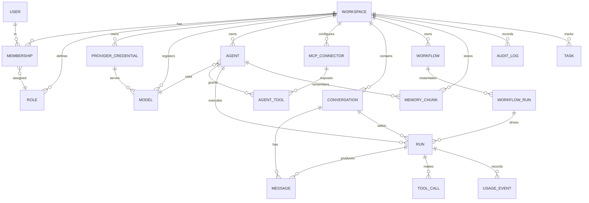

# 03 — Database Schema

PostgreSQL is the system of record. Drizzle ORM (`packages/db`) owns the schema and migrations. Qdrant holds vectors; Postgres holds the **metadata/pointers** for those vectors. Redis holds ephemeral state (queues, rate counters, pub/sub) and is never the source of truth.

Conventions: ULID primary keys (`xxx_<ulid>`), `created_at`/`updated_at` on every table, soft-delete via `deleted_at` where users can delete, `workspace_id` foreign key on every tenant-scoped table (row-level multi-tenancy).

## ER diagram

## Tables

### Tenancy & identity
| Table | Key columns | Notes |
|-------|-------------|-------|
| `workspaces` | `id`, `name`, `slug`, `plan`, `settings jsonb` | tenant root |
| `users` | `id`, `clerk_id`, `email`, `name`, `avatar_url` | mirror of Clerk identity |
| `memberships` | `id`, `workspace_id`, `user_id`, `role_id`, `status` | M:N user↔workspace |
| `roles` | `id`, `workspace_id`, `name`, `permissions jsonb` | RBAC; see [13](./13-security-deployment-scaling.md#rbac) |

### Providers, credentials, models
| Table | Key columns | Notes |
|-------|-------------|-------|
| `provider_credentials` | `id`, `workspace_id`, `provider`, `label`, `ciphertext bytea`, `key_version`, `base_url`, `meta jsonb`, `last_used_at` | secret stored as **envelope-encrypted** blob; plaintext never leaves gateway. `provider` enum: openai/anthropic/google/ollama/openrouter/groq/together/huggingface |
| `models` | `id`, `workspace_id`, `provider`, `credential_id`, `model_id`, `display_name`, `modalities`, `context_window`, `input_price`, `output_price`, `supports_tools`, `enabled` | price per 1M tokens; basis for cost calc |

### Agents & tools
| Table | Key columns | Notes |
|-------|-------------|-------|
| `agents` | `id`, `workspace_id`, `name`, `kind`, `system_prompt`, `model_id`, `settings jsonb` (temp, top_p, max_tokens, tool_choice), `memory_config jsonb`, `status`, `cost_to_date` | `kind`: research/coding/trading/finance/data/social/compliance/custom |
| `mcp_connectors` | `id`, `workspace_id`, `name`, `transport` (stdio/http/sse), `endpoint`, `config jsonb`, `auth_ref`, `health`, `last_health_at` | one row per connected MCP server |
| `agent_tools` | `id`, `agent_id`, `connector_id`, `tool_name`, `enabled`, `policy jsonb` (HITL gate, rate cap) | which tools an agent may call |

### Conversations, runs, messages
| Table | Key columns | Notes |
|-------|-------------|-------|
| `conversations` | `id`, `workspace_id`, `title`, `participant_agent_ids text[]`, `created_by` | supports multi-agent (@-mention) |
| `runs` | `id`, `workspace_id`, `agent_id`, `conversation_id?`, `workflow_run_id?`, `status`, `trigger`, `started_at`, `finished_at`, `error jsonb`, `trace_id` | one agent execution; state machine in [06](./06-agent-lifecycle.md) |
| `messages` | `id`, `conversation_id`, `run_id?`, `role` (user/assistant/tool/system), `content jsonb`, `agent_id?`, `created_at` | content is structured (text parts, tool parts) |
| `tool_calls` | `id`, `run_id`, `connector_id`, `tool_name`, `args jsonb`, `result jsonb`, `status`, `approved_by?`, `latency_ms`, `error jsonb` | full tool-call audit incl. HITL approver |

### Workflows
| Table | Key columns | Notes |
|-------|-------------|-------|
| `workflows` | `id`, `workspace_id`, `name`, `graph jsonb` (nodes+edges), `triggers jsonb`, `enabled`, `version` | DAG definition; see [07](./07-orchestration-multiagent.md) |
| `workflow_runs` | `id`, `workflow_id`, `status`, `input jsonb`, `output jsonb`, `state jsonb` (per-node state), `started_at`, `finished_at` | one execution of a workflow |
| `tasks` | `id`, `workspace_id`, `title`, `assignee_agent_id?`, `status`, `priority`, `payload jsonb`, `run_id?` | human/agent assignable work items |

### Memory & RAG
| Table | Key columns | Notes |
|-------|-------------|-------|
| `knowledge_sources` | `id`, `workspace_id`, `type` (file/url/db), `uri`, `status` (queued/embedding/ready/error), `meta jsonb` | RAG source registry |
| `memory_chunks` | `id`, `workspace_id`, `agent_id?`, `source_id?`, `scope` (short/long), `text`, `vector_id` (Qdrant point id), `embedding_model`, `tokens`, `metadata jsonb` | Postgres holds text+pointer; vector lives in Qdrant |

### Observability & cost
| Table | Key columns | Notes |
|-------|-------------|-------|
| `usage_events` | `id`, `workspace_id`, `run_id?`, `agent_id?`, `provider`, `model_id`, `input_tokens`, `output_tokens`, `cached_tokens`, `cost_usd`, `latency_ms`, `ts` | one row per model call; basis of all cost dashboards. See [11](./11-observability-cost.md) |
| `audit_logs` | `id`, `workspace_id`, `actor jsonb`, `action`, `target jsonb`, `meta jsonb`, `ip`, `ts` | security-relevant actions (cred change, role change, approvals) |

## Key indexes

- `usage_events (workspace_id, ts DESC)` and `(workspace_id, agent_id, ts DESC)` — time-series cost/agent rollups (consider monthly partitioning or TimescaleDB hypertable at scale).
- `messages (conversation_id, created_at)` — chat pagination.
- `runs (workspace_id, status, started_at DESC)` — live agent grid.
- `tool_calls (run_id)`, `audit_logs (workspace_id, ts DESC)`.
- Partial index `agents (workspace_id) WHERE deleted_at IS NULL`.
- Unique: `memberships (workspace_id, user_id)`, `models (workspace_id, provider, model_id)`.

## Multi-tenancy & isolation

Every tenant-scoped query is filtered by `workspace_id`, enforced centrally in the repository layer (and optionally Postgres **Row-Level Security** policies keyed off a `SET app.workspace_id`). No cross-workspace joins. Credentials are additionally workspace-scoped at the encryption-key level (per-workspace data key under a master KMS key) — see [13](./13-security-deployment-scaling.md#secrets).
