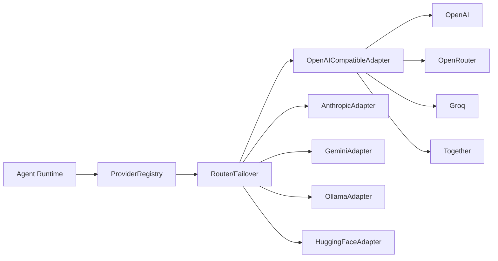

# 05 — Provider Abstraction Layer

`packages/providers` is the heart of "provider-agnostic." It exposes **one interface** that every adapter implements. Nothing above it (agent runtime, workflows, UI) knows or cares which vendor served a call.

## The contract

```ts
// packages/providers/src/contract.ts  (interface sketch — not full impl)
export interface LLMProvider {
  readonly id: ProviderId;          // 'openai' | 'anthropic' | 'google' | 'ollama' | ...
  capabilities(model: string): ModelCapabilities;
  chat(req: UnifiedRequest, opts: CallOpts): Promise<UnifiedResult>;     // non-streaming
  stream(req: UnifiedRequest, opts: CallOpts): AsyncIterable<StreamEvent>; // streaming
  countTokens(req: UnifiedRequest): Promise<TokenCount>;                 // pre-flight estimate
  embed?(input: string[], model: string): Promise<number[][]>;          // optional
}

export interface UnifiedRequest {
  model: string;
  messages: UnifiedMessage[];       // role: system|user|assistant|tool, structured content parts
  tools?: ToolSpec[];               // JSON-Schema tools, normalized to one shape
  toolChoice?: 'auto' | 'none' | 'required' | { name: string };
  temperature?: number; topP?: number; maxTokens?: number;
  responseFormat?: 'text' | 'json' | { schema: JSONSchema };
  metadata?: Record<string, string>;
}

export type StreamEvent =
  | { type: 'token'; delta: string }
  | { type: 'tool_call'; id: string; name: string; argsDelta: string }   // streamed partial args
  | { type: 'tool_call_done'; id: string; name: string; args: unknown }
  | { type: 'reasoning'; delta: string }                                  // thinking, where supported
  | { type: 'finish'; reason: FinishReason; usage: Usage }
  | { type: 'error'; error: ProviderError };

export interface Usage {
  inputTokens: number; outputTokens: number;
  cachedInputTokens?: number; reasoningTokens?: number;
}
```

The adapter's job is to translate **provider-native ⇄ unified** in both directions: request shape, streaming chunk format, tool-call encoding, finish reasons, usage fields, and errors.

## Adapters (all 8 providers)

| Provider | Transport | Tools | Streaming | Token counting | Notes |
|----------|-----------|-------|-----------|----------------|-------|
| OpenAI | HTTPS (Responses/Chat API) | native | SSE deltas | tiktoken (local) + API usage | function calling, json schema |
| Anthropic | HTTPS Messages API | native (`tool_use`) | SSE deltas | API usage + heuristic pre-flight | thinking blocks → `reasoning` events; prompt caching surfaced as `cachedInputTokens` |
| Google Gemini | HTTPS generateContent | `functionDeclarations` | streamGenerateContent | API usage | parts/role mapping differs |
| Ollama | local HTTP | native (newer models) | NDJSON chunks | local tokenizer estimate | **local/offline**, no cost |
| OpenRouter | HTTPS (OpenAI-compatible) | passthrough | SSE | upstream usage | meta-provider; routing/fallback built in |
| Groq | HTTPS (OpenAI-compatible) | native | SSE | upstream usage | very low latency |
| Together | HTTPS (OpenAI-compatible) | native | SSE | upstream usage | open models hosted |
| Hugging Face | Inference API/Endpoints | varies | SSE/chunks | estimate | capability varies by model |

Several are OpenAI-wire-compatible → a shared `OpenAICompatibleAdapter` base covers OpenRouter/Groq/Together (and OpenAI itself), with thin overrides. Anthropic, Gemini, Ollama, and HF get dedicated adapters.



## Registry, routing & failover

`ProviderRegistry` resolves `model_id → (adapter, credential)` using the `models`/`provider_credentials` tables. A **Router** sits in front to implement:

- **Explicit selection** — agent pins a model.
- **Capability routing** — request needs tools/vision/json-schema → pick a model that supports it.
- **Policy routing** — "cheapest that meets quality bar", "lowest latency", "keep PII on local Ollama".
- **Failover** — on retryable error (429/5xx/timeout), retry with backoff, then fail over to a configured alternate (e.g., Anthropic 529 → OpenAI). Failover is recorded in the trace + surfaced in the error `detail`.

```ts
const route = router.resolve({
  required: { tools: true },
  prefer: 'cost',                       // or 'latency' | 'quality'
  fallbacks: ['anthropic:claude-opus-4-8', 'openai:gpt-4o'],
});
```

## Retry & resilience

- Exponential backoff with jitter on `429/500/502/503/504/timeout`.
- Per-provider **circuit breaker** — after N consecutive failures, mark `provider.health=degraded`, emit `provider.health_changed`, and route around it until a probe succeeds.
- Streaming retries are **safe before first token only**; once tokens flow, an interrupted stream surfaces as `error` and the run is marked `failed` (the runtime decides whether to restart).

## Token counting & cost

- **Pre-flight:** `countTokens` gives an estimate for budgeting/routing (local tokenizers where available, heuristics otherwise).
- **Authoritative:** provider-reported `usage` on `finish` is the source of truth.
- Cost = `inputTokens × model.input_price + outputTokens × model.output_price` (cached/reasoning tokens priced separately where the provider distinguishes them). Each call emits a `usage_event` ([11](./11-observability-cost.md#token--cost-accounting)).

## Error taxonomy (shared with API)

`AUTH`, `RATE_LIMIT`, `CONTEXT_LENGTH`, `CONTENT_FILTER`, `PROVIDER_UNAVAILABLE`, `TIMEOUT`, `BAD_REQUEST`, `TOOL_ERROR`, `UNKNOWN` — each with a `retryable` flag. Adapters map vendor errors into this enum so the runtime and UI handle them uniformly.

## Adding a new provider

1. Add an adapter implementing `LLMProvider` under `src/adapters/`.
2. Register it in `ProviderRegistry` + add to the `provider` enum in `packages/types`.
3. Add models + pricing to the `models` table (seed or UI).

No changes to agent-core, workflows, gateway, or UI. That's the whole point.
