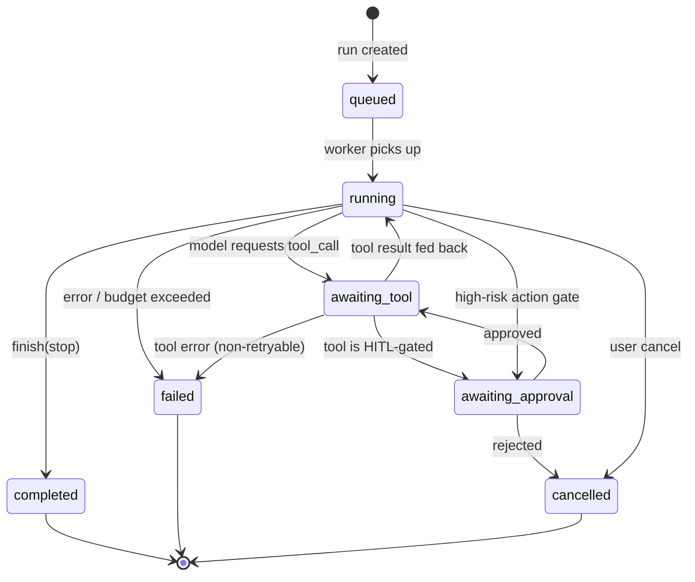

# 06 — Agent Lifecycle

## Agent definition

An agent is a **declarative configuration** (row in `agents`) plus a **runtime** that executes it. The definition:

```ts
// inferred from packages/types
interface AgentDefinition {
  id: string;
  name: string;
  kind: 'research' | 'coding' | 'trading' | 'finance' | 'data' | 'social' | 'compliance' | 'custom';
  systemPrompt: string;
  modelId: string;                          // resolves via ProviderRegistry
  settings: {                               // provider-neutral knobs
    temperature?: number; topP?: number; maxTokens?: number;
    toolChoice?: 'auto' | 'none' | 'required';
    maxToolIterations?: number;             // tool-loop cap (default 8)
    budget?: { maxUsdPerRun?: number; maxTokensPerRun?: number };
  };
  memory: {
    shortTerm: 'window' | 'summary' | 'none';   // working memory strategy
    longTerm: boolean;                            // RAG-backed recall
    retrieval?: { topK: number; sources?: string[] };
  };
  tools: AgentToolGrant[];                  // connector + tool name + policy (HITL gate, rate cap)
  status: AgentStatus;                      // live, see state machine
  costToDate: number;
}
```

Example agents ship as seed templates: **Research**, **Coding**, **Trading** (wired to `tradingview-mcp`), **Finance**, **Data Analyst**, **Social Media**, **RWA Compliance** — each is just a different prompt + model + tool grant + HITL policy.

## Run state machine

A **run** is one execution of an agent. Status transitions are persisted (`runs.status`) and each transition emits an event.



## The agent loop (tool-calling)

```mermaid
sequenceDiagram
  participant AR as Agent Runtime
  participant MEM as Memory
  participant PR as Provider Layer
  participant MCP as MCP Client
  participant GW as Gateway/UI

  AR->>MEM: assemble context (system + retrieved memory + history)
  loop until finish or maxToolIterations
    AR->>PR: stream(unifiedRequest)
    PR-->>AR: tokens / tool_call
    alt tool_call
      AR->>AR: check policy
      opt HITL-gated
        AR->>GW: awaiting_approval
        GW-->>AR: approve / reject
      end
      AR->>MCP: invoke tool(args)
      MCP-->>AR: result (or error)
      AR->>AR: append tool result to messages
    else finish
      AR->>MEM: write short-term + long-term memory
      AR->>GW: usage + done
    end
    AR->>AR: enforce budget (tokens/usd); abort if exceeded
  end
```

Guardrails baked into the loop:
- **Iteration cap** (`maxToolIterations`) prevents infinite tool loops.
- **Budget enforcement** — running token/usd totals checked each turn; exceeding `budget` fails the run cleanly with `BUDGET_EXCEEDED`.
- **Timeout** per run and per tool call.
- **Idempotent tool calls** where the connector declares them safe to retry.

## Human-in-the-loop (HITL)

Any `agent_tool` can carry a `policy.requireApproval` flag (e.g., `replay_trade`, `gmail.send`, `github.merge`). When the model requests such a tool:

1. Run enters `awaiting_approval`; a `run.awaiting_approval` event hits the UI.
2. Operator sees the proposed tool + args in the chat/approvals panel.
3. `POST /v1/runs/:id/approve` (or `/reject`) — approver recorded in `tool_calls.approved_by` + `audit_logs`.
4. On approve → tool executes; on reject → run is cancelled (or the model is told the action was denied, per policy).

Approvals can also be **global policies** (e.g., "any tool that spends money" or "any external write") matched by connector metadata, not just per-tool flags.

## Live status

`agents.status` reflects aggregate live state derived from active runs: `idle`, `running`, `awaiting_approval`, `error`, `disabled`. The live agent grid ([12](./12-ui-ux.md)) subscribes to `agent.status_changed` over WS. Per-agent stats (current task, token usage, latency, active workflows) come from joining the latest `runs` + `usage_events`.

## Persistence & replay

Every run persists its full message trail, tool calls, and usage. A run is therefore **fully reconstructable** for audit and for the memory viewer. Because state lives in Postgres (not the worker), a crashed worker's run can be resumed or retried by another worker — runs are designed to be **restartable from the last durable checkpoint** (last persisted message/tool result).
