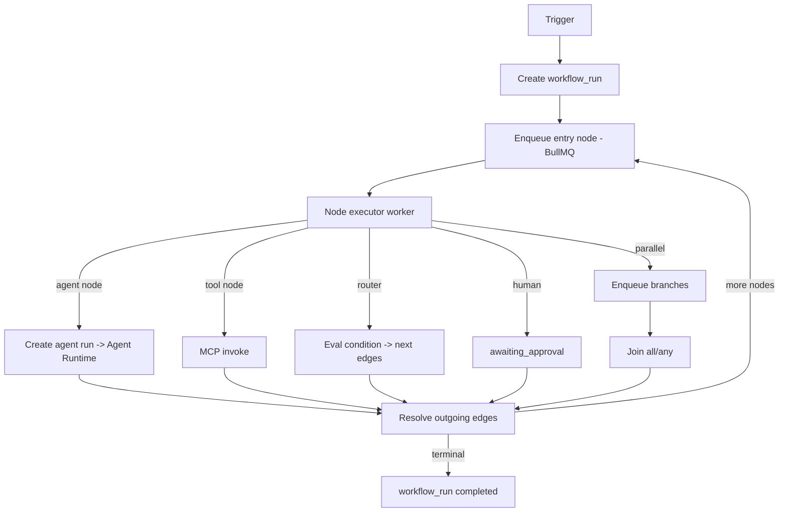
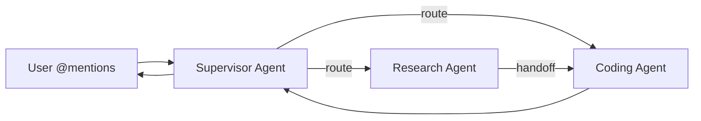
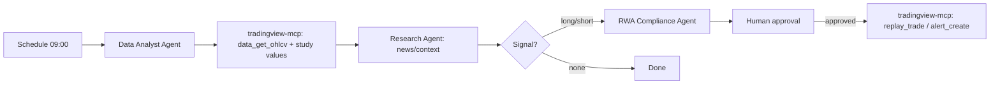

# 07 — Orchestration & Multi-Agent

`packages/agent-core` contains the orchestrator and workflow engine. The model is a **directed graph** (LangGraph-style): nodes are units of work, edges carry state and conditions. A single agent run is the degenerate case (one node).

## Graph model

```ts
interface WorkflowGraph {
  nodes: WorkflowNode[];
  edges: WorkflowEdge[];          // source -> target, with optional condition
  entry: string;                  // entry node id
}

type WorkflowNode =
  | { id: string; type: 'agent';   agentId: string; input?: Mapping }
  | { id: string; type: 'tool';    connectorId: string; tool: string; args?: Mapping }
  | { id: string; type: 'router';  routes: { when: Expr; to: string }[] }   // conditional branch
  | { id: string; type: 'parallel'; branches: string[]; join: 'all' | 'any' }
  | { id: string; type: 'human';   prompt: string }                          // HITL gate
  | { id: string; type: 'map';     over: Expr; node: string }                // fan-out per item
  | { id: string; type: 'code';    fn: string };                             // sandboxed transform

interface WorkflowEdge { from: string; to: string; when?: Expr; }
```

Shared **state object** flows through the graph; each node reads inputs via `Mapping` (JSONPath-like) and writes outputs back into state. State is persisted per node in `workflow_runs.state` so a run survives restarts.

## Workflows

### Triggers
A workflow runs on:
- **Manual** — `POST /v1/workflows/:id/run`.
- **Schedule** — cron (BullMQ repeatable job).
- **Event** — matched against the event bus (`workflow.trigger matcher` subscribes to Redis Streams; e.g., "when `connector.health_changed` to down", "when a `task` is created with priority=high").
- **Webhook** — inbound HTTP endpoint per workflow.

### Execution engine


The engine is **durable** (state in Postgres, work in BullMQ) and **at-least-once**; nodes must be idempotent or guarded by a node-execution key. Long-running agent nodes don't block workers — they create child agent `runs` and the engine resumes on `run.completed` events.

## Multi-agent

Two collaboration shapes, both expressed in the same graph model:

### 1. Conversational (chat console)
A conversation can have multiple participant agents. The operator **@-mentions** agents; the orchestrator routes the turn to the mentioned agent(s). Agents can also be configured to **hand off** to each other (an agent emits a `handoff(targetAgent, reason)` pseudo-tool), enabling patterns like:

- **Supervisor / router** — a coordinator agent decides which specialist handles each turn.
- **Debate / critique** — two agents alternate; a judge agent scores.
- **Pipeline** — researcher → writer → editor.



### 2. Workflow (graph)
Specialist agents are nodes; edges encode the collaboration topology (sequential, parallel fan-out/fan-in, conditional). Example — a "Trade Idea" workflow:



## Intelligent model routing

Two layers of routing work together:

1. **Provider/model routing** ([05](./05-provider-abstraction.md#registry-routing--failover)) — within a single call, pick the best model for capability/cost/latency, with failover.
2. **Agent/task routing** (here) — a **router node** or **supervisor agent** decides *which agent* handles a task based on the task type, the agents' `kind`, and recent performance/cost. Routing rules can be declarative (`router.routes`) or model-driven (supervisor agent reasons over the task and available agents).

This separation means "which brain answers this token" and "which worker owns this task" are independently optimizable.

## Failure & compensation

- Node failure → retry policy (count + backoff) on the edge; on exhaustion, route to an `onError` edge if defined, else fail the workflow_run.
- **Compensation edges** allow undo steps (e.g., cancel an alert created earlier) when a downstream node fails — useful for the trading/finance flows where side effects matter.
- All node transitions emit `workflow.step_*` events for the live workflow view.
