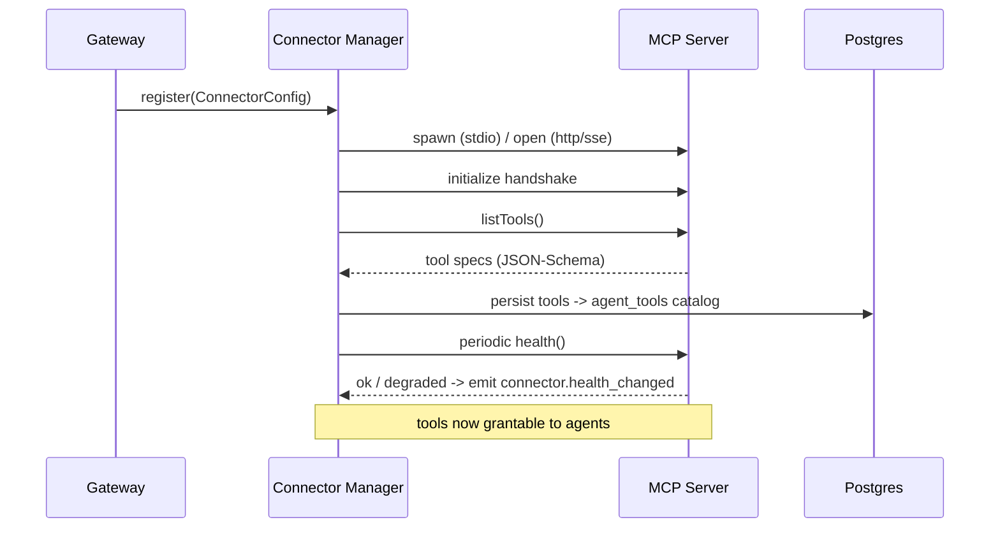

# 08 — MCP Integration

Tools reach the outside world through the **Model Context Protocol**. `packages/mcp-connectors` is a thin, uniform client layer over many MCP servers. Agents never speak a connector's native protocol — they call normalized tools, and the connector manager handles transport, auth, discovery, and sandboxing.

## Connector model

```ts
interface ConnectorConfig {
  id: string;
  name: string;
  transport: 'stdio' | 'http' | 'sse';
  endpoint: string;                 // command+args for stdio, URL for http/sse
  authRef?: string;                 // -> provider_credentials / secret store
  config: Record<string, unknown>;  // server-specific (e.g., CDP port for tradingview)
  scopes?: string[];                // capability allow-list
}

interface MCPClient {
  connect(): Promise<void>;
  listTools(): Promise<ToolSpec[]>;        // capability discovery (JSON-Schema)
  listResources?(): Promise<ResourceRef[]>;
  call(tool: string, args: unknown, ctx: CallContext): Promise<ToolResult>;
  health(): Promise<HealthStatus>;
  close(): Promise<void>;
}
```

## Lifecycle



Connections are **pooled and long-lived** (stdio servers stay warm; http/sse reuse keep-alive). The manager handles reconnection with backoff and surfaces `connector.health_changed` to the infra panel.

## Capability discovery → tool grants

On connect, the manager pulls each server's tool specs (name, description, input JSON-Schema) and stores them. An operator then **grants** specific tools to specific agents (`agent_tools`), optionally with a policy (HITL gate, rate cap, arg constraints). At runtime, the agent's available toolset is the union of its grants — the model only ever sees tools it's allowed to call.

## Sandboxing & permissions

Defense in depth, because tools touch real systems:

- **Scope allow-list** per connector (`scopes`) — only declared capabilities are exposed.
- **Per-tool policy** — `requireApproval` (HITL), `rateLimit`, `argSchemaOverride` (tighten the server's schema, e.g., restrict filesystem connector to a directory).
- **Credential isolation** — connector auth pulled from the encrypted secret store at call time; never embedded in agent config or sent to the model.
- **Process isolation** — stdio connectors run as constrained child processes (own working dir, dropped env, optional container/namespace). HTTP connectors go through an egress allow-list.
- **Full audit** — every `call` writes a `tool_calls` row (args, result, latency, approver). Args/results can be redacted by policy before logging.

## Connector catalog

| Connector | Transport | Example tools | Notes |
|-----------|-----------|---------------|-------|
| **TradingView** (this repo) | stdio (CDP-backed) | `chart_get_state`, `data_get_ohlcv`, `replay_trade`, `alert_create` | first-class example; `replay_trade` is HITL-gated |
| Filesystem | stdio | `read_file`, `write_file`, `list_dir` | dir-scoped via argSchemaOverride |
| Postgres/DB | stdio/http | `query`, `schema` | read-only role by default |
| GitHub | http | `list_prs`, `create_pr`, `comment` | write ops HITL-gated |
| Slack | http | `post_message`, `search` | post HITL-gated |
| Notion | http | `search`, `create_page` | |
| Gmail | http | `search`, `send` | `send` HITL-gated |
| Google Drive | http | `search`, `get_file` | |
| Internal systems | http/sse | custom | per-tenant |

## Extensibility — adding a connector

1. Point a `ConnectorConfig` at any MCP server (no code if it's a standard MCP server).
2. The manager discovers its tools automatically.
3. Grant tools to agents and set policies.

This is the **plugin/extension system** (subsystem #13): the platform gains capabilities by connecting MCP servers and registering provider adapters — no core changes. The TradingView MCP proves the path end-to-end: its 68 tools become grantable agent capabilities with zero bespoke integration code beyond the standard connector config.
