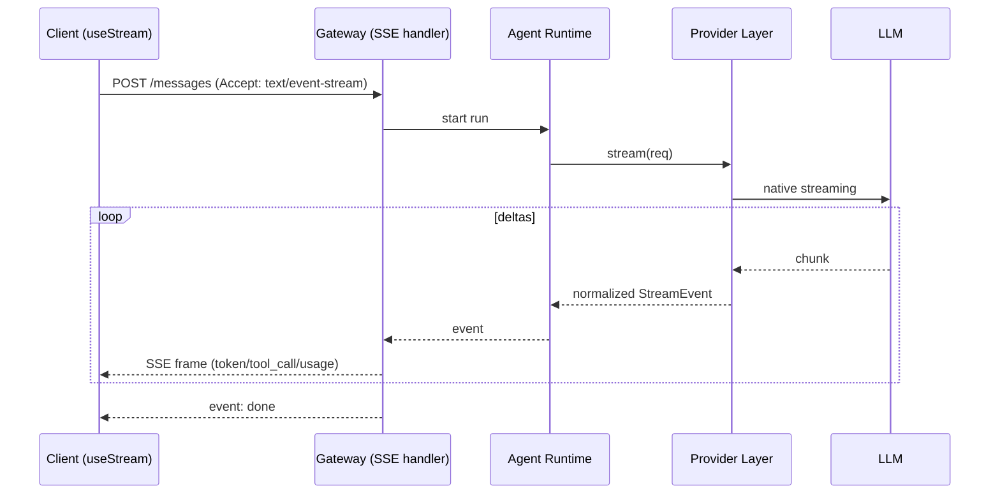
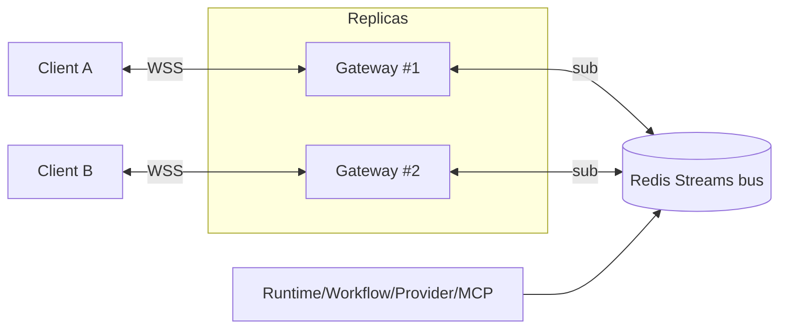

# 09 — Streaming & WebSocket Architecture

Two complementary realtime transports, each used where it's strongest. See [04](./04-api-architecture.md#realtime-api) for the wire format.

| | **SSE** | **WebSocket** |
|--|--------|---------------|
| Scope | one completion / run | whole workspace |
| Direction | server → client | bidirectional |
| Lifetime | length of the request | persistent (page session) |
| Use | token deltas, tool events for *this* message | agent grid, workflow steps, cost ticker, presence, health |
| Why | proxy-friendly, auto-reconnect, no handshake overhead for a unidirectional stream | low-latency fan-out, client can subscribe/unsubscribe topics, send control msgs |

## Token streaming (SSE) end-to-end

- The gateway **normalizes** every provider's chunk format into the same `StreamEvent` set ([05](./05-provider-abstraction.md)) before it hits the wire, so the client renders one event schema regardless of vendor.
- **Backpressure:** if the client is slow, the gateway buffers a bounded window then applies provider-level pause where supported, else drops to a "catch-up" coalesced delta. The full message is always persisted, so a slow/dead client never loses content — it can re-fetch the final message via REST.

## WebSocket live state

- Each gateway replica subscribes to the shared bus and pushes relevant events to its connected sockets, filtered by the socket's **subscribed topics** and the user's **workspace + permissions**. Any replica can serve any client — **no sticky sessions required**.
- **Multi-user concurrency & presence:** `presence.*` events broadcast who is viewing which agent/conversation/workflow. Optimistic UI updates are reconciled against authoritative events.
- **Authorization on every event:** the broadcaster re-checks that the socket's principal may see an event's `workspaceId`/subject before delivery (events never leak across tenants).

## Reconnection & resume

- **SSE:** the browser's `EventSource` auto-reconnects; we attach a `Last-Event-ID` cursor. If a run is still active, the gateway resumes streaming from the last delivered event; if it finished, the client fetches the final message via REST and closes.
- **WS:** client reconnects with the last seen event id per topic; the gateway replays missed events from the Redis Stream (bounded by retention window), then resumes live. This gives **at-least-once** delivery with client-side dedupe by `event.id`.
- **Run durability:** because runs persist incrementally ([06](./06-agent-lifecycle.md#persistence--replay)), a disconnected client never loses work — the run continues server-side and state is recoverable.

## Why not one transport for everything

A single WS could carry token streams too, but SSE keeps the common "send a message, watch it stream" path simple, cache/proxy-friendly, and trivially resumable, while reserving WS for the genuinely bidirectional, multiplexed, fan-out workspace state. Each transport stays simple by doing one job well.
