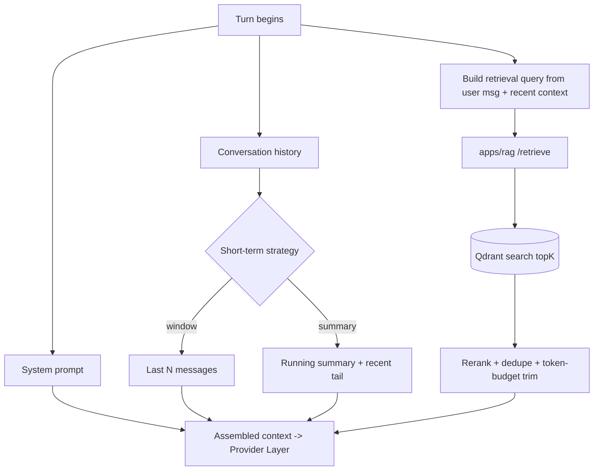
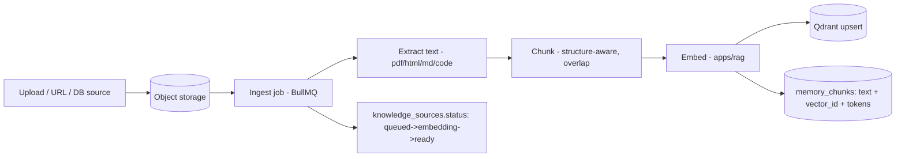

# 10 — Memory & RAG

Agents need three kinds of recall: **working memory** (this run), **conversational memory** (this thread), and **long-term knowledge** (vector-retrieved). `apps/rag` (FastAPI) owns embeddings + retrieval; `packages/db` holds the metadata; Qdrant holds the vectors.

## Memory tiers

| Tier | Lifetime | Storage | Strategy |
|------|----------|---------|----------|
| **Working / short-term** | one run | in-context + `messages` | sliding **window** or rolling **summary** (configurable per agent) |
| **Conversational** | one conversation | `messages` | loaded + windowed/summarized into context |
| **Long-term** | persistent | `memory_chunks` + Qdrant | semantic retrieval (RAG) on demand |

Per-agent config (`agents.memory`) picks the short-term strategy and whether long-term recall + retrieval are enabled ([06](./06-agent-lifecycle.md)).

## Context assembly (per turn)

A **token budget** governs assembly: system prompt + retrieved chunks + history must fit the model's context window with headroom for the response. Lowest-value items (oldest history, lowest-scored chunks) are dropped first.

## Ingestion pipeline (RAG indexing)

- `knowledge_sources.status` drives the **"embeddings status"** indicator in the Knowledge Base panel ([12](./12-ui-ux.md)).
- Embedding model is configurable per workspace (OpenAI `text-embedding-3`, local via Ollama, etc.) through the same provider layer (`embed()`); the chosen model is recorded on each chunk so re-embedding/migration is possible.
- Chunking is **structure-aware** (headings/code blocks/tables) with overlap to preserve context.

## Retrieval

`apps/rag /retrieve` takes `{ workspaceId, query, topK, sources?, filters? }` and:
1. Embeds the query.
2. Vector-searches Qdrant within the workspace's collection (workspace + optional source filter).
3. Optionally **hybrid** (vector + keyword/BM25) and **reranks** results.
4. Returns chunks with scores + source metadata for citation.

Multi-tenant isolation: one Qdrant collection per workspace (or a shared collection with mandatory `workspace_id` payload filter). The RAG service always scopes by workspace — no cross-tenant retrieval.

## Long-term agent memory (write path)

Agents can persist salient facts to long-term memory at run end (`memory.longTerm: true`). The runtime extracts memory candidates (summaries, learned facts, user preferences), embeds, and upserts them as `memory_chunks` with `scope='long'` and an `agent_id`. On later runs these surface through normal retrieval — giving agents durable, queryable memory.

## Memory viewer (UI contract)

`GET /v1/memory?agentId=&scope=&q=` returns, for the viewer panel:
- **Short-term:** the current working context (windowed messages or active summary).
- **Long-term:** retrieved chunks with text, source, score, embedding model, and timestamp.
- **Retrieval context:** for a selected run, exactly which chunks were injected — so an operator can audit *why* an agent said what it did. This closes the loop between observability ([11](./11-observability-cost.md)) and memory.
