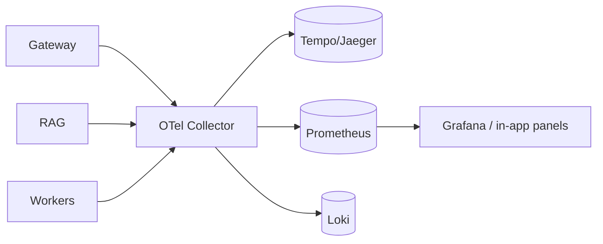

# 11 — Observability & Cost

The event-driven core ([01](./01-system-architecture.md#event-driven-core)) makes observability a byproduct of normal operation: every model call, tool call, and state transition already emits a structured event. This section defines how those become traces, metrics, logs, and cost.

## Three pillars (OpenTelemetry)

- **Traces** — a run is a trace; each model call, tool call, retrieval, and workflow node is a span. `traceId` is threaded from the API request through events into the trace, so a UI "view trace" jumps straight to the span tree.
- **Metrics** — counters/histograms: tokens, cost, latency (p50/p95/p99), tool-call success rate, provider error rate, queue depth, active runs, WS connections.
- **Logs** — structured JSON logs correlated by `traceId`/`runId`; tool args/results redactable by policy before export.



The in-app **Observability panel** reads the same data (via the gateway) so operators don't need to leave Mission Control for day-to-day drill-down; Grafana/Jaeger remain available for deep infra work.

## Token & cost accounting

The authoritative record is `usage_events` — **one row per model call**, written by the usage writer consuming `usage.recorded` events.

```jsonc
// usage_events row
{
  "id": "ue_...", "workspaceId": "ws_...", "runId": "run_...", "agentId": "agt_...",
  "provider": "anthropic", "modelId": "claude-opus-4-8",
  "inputTokens": 812, "outputTokens": 230, "cachedTokens": 0, "reasoningTokens": 40,
  "costUsd": 0.0041, "latencyMs": 1830, "ts": "2026-05-29T12:00:01Z"
}
```

### Cost computation
At call finish, the provider layer reports authoritative `usage`. Cost is computed from the `models` pricing columns:

```
costUsd = inputTokens  * model.input_price / 1e6
        + outputTokens * model.output_price / 1e6
        + cachedTokens * model.cached_price / 1e6     // if provider distinguishes
        + reasoningTokens * model.output_price / 1e6  // priced as output unless provider differs
```

Local models (Ollama) record tokens with `costUsd = 0` (compute cost can be attributed separately via an infra cost model if desired).

### Rollups & budgets
- `GET /v1/usage?groupBy=agent|model|day|workflow&from=&to=` powers cost dashboards by aggregating `usage_events` (indexed `(workspace_id, ts)`; partition/Timescale at scale).
- **Budgets & alerts:** per-agent `budget` enforced live in the run loop ([06](./06-agent-lifecycle.md)); per-workspace soft/hard caps trigger alerts (and optional throttling) when projected spend crosses thresholds.
- A live **cost ticker** subscribes to `usage.recorded` over WS for real-time spend.

## Observability panel data

| Widget | Source |
|--------|--------|
| Logs stream | Loki / `audit_logs` + structured logs by `traceId` |
| Errors | spans with error status + `runs.error` + provider error metrics |
| Traces | Tempo/Jaeger span tree by `traceId` |
| API calls | gateway request metrics + per-call spans |
| Model performance | latency histograms + tokens/sec + error rate per `modelId` |
| Token costs | `usage_events` rollups |

## Infrastructure panel data

| Widget | Source |
|--------|--------|
| GPU/server (Ollama hosts) | node exporter / Ollama metrics |
| API health | `provider.health_changed` + circuit-breaker state ([05](./05-provider-abstraction.md#retry--resilience)) |
| Queue management | BullMQ queue depths, in-flight, failed/retry counts |
| Rate limits | per-provider + per-workspace limiter state ([13](./13-security-deployment-scaling.md#rate-limiting)) |
| Connector health | `connector.health_changed` ([08](./08-mcp-integration.md)) |

## Why this design

Because cost and traces are derived from the **same events** that drive the live UI, there is exactly one source of truth and no separate instrumentation to drift. Adding a new provider or tool automatically appears in cost, traces, and dashboards with zero extra wiring — it just emits the standard events.
