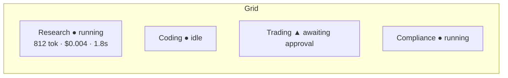

# 12 — UI / UX

Dark-mode-first, dense-but-calm "mission control." Reference points: **Linear** (keyboard-driven, crisp lists), **Vercel** (clean surfaces), **Cursor** (chat+work side by side), **Palantir/Tesla mission control** (live ops at a glance), **cyberpunk minimal** (restrained neon accents on near-black).

## Design language

- **Theme:** near-black base (`#0A0B0D`), elevated surfaces in subtle grays, single accent per state (cyan = live, amber = awaiting, red = error, green = ok). Monospace for IDs/metrics, sans for prose.
- **Motion:** Framer Motion for state transitions only (status changes, panel reveals, streaming cursor). No gratuitous animation — motion communicates state.
- **Density:** information-dense grids and tables with generous-but-tight spacing; everything keyboard-navigable (⌘K command palette, j/k lists, `@` mentions).
- **Components:** shadcn/ui primitives composed in `packages/ui`; shared design tokens.
- **Responsive:** three-column on desktop, collapsible rail + single pane on tablet/mobile.

## Information architecture

```
┌───────────────────────────────────────────────────────────────────────┐
│ Top bar: workspace switcher · ⌘K · global cost ticker · health · user   │
├──────────┬────────────────────────────────────────────────────────────┤
│ Left rail│  Main view (route)                          │ Right context  │
│ • Mission│                                             │ panel (varies) │
│ • Agents │                                             │ • run details  │
│ • Chat   │                                             │ • approvals     │
│ • Flows  │                                             │ • memory viewer │
│ • Observ.│                                             │ • presence      │
│ • Infra  │                                             │                │
│ • Knowl. │                                             │                │
│ • Settings                                             │                │
└──────────┴────────────────────────────────────────────┴────────────────┘
```

## Primary surfaces

### 1. Mission (live agent grid)
The home screen. A grid of agent cards, each showing: name + `kind` icon, **status** (cyan/amber/red/idle), current task, live token usage + cost, latency, and active-workflow badges. Backed by WS (`agent.status_changed`, `run.*`, `usage.recorded`). Clicking a card opens its run history + the right-panel run detail. This is the Tesla/Palantir "everything at a glance" view.



### 2. Global chat console
Cursor-like split. Left: conversation with streaming responses (SSE), `@`-mention to address specific agents, multi-agent threads, tool-call cards inline (with approve/reject when gated). Right: the addressed agent's context (model, tools, retrieved memory for the current turn). Supports talking to one or many agents in the same thread ([07](./07-orchestration-multiagent.md#1-conversational-chat-console)).

### 3. Workflow builder
Drag-and-drop DAG canvas (React Flow). Node palette: agent, tool, router, parallel, human, map, code. Edges carry conditions. Trigger config (manual/cron/event/webhook). A **live run overlay** animates node states (`workflow.step_*`) as a workflow executes — you watch tasks flow through the graph in real time.

### 4. Observability panel
Tabs: Logs · Errors · Traces · API calls · Model performance · Token costs. Trace view is a span tree (run → model/tool/retrieval spans). Filter by agent/model/time. Data from [11](./11-observability-cost.md).

### 5. Infrastructure panel
GPU/server cards (Ollama hosts), provider API health (with circuit-breaker state), queue depths, rate-limit gauges, connector health. Red/amber/green at a glance; click to drill in.

### 6. Knowledge base panel
Uploaded docs + URLs + DB sources as a list with **embeddings status** (queued/embedding/ready/error progress), vector DB stats (collection size, dims), and a RAG **playground** to test retrieval against a query.

### 7. Agent memory viewer (right context panel)
For a selected agent/run: short-term working context, long-term retrieved chunks (text + score + source), and — crucially — **exactly which chunks were injected into a given run**, for auditability ([10](./10-memory-rag.md#memory-viewer-ui-contract)).

## Cross-cutting UX

- **⌘K command palette** — jump to any agent/conversation/workflow, run an agent, switch workspace.
- **Approvals are first-class** — a persistent approvals tray surfaces every `awaiting_approval`; one keystroke to approve/reject with full context.
- **Optimistic + reconciled** — UI updates optimistically, then reconciles against authoritative WS events (dedupe by `event.id`).
- **Empty/loading/error states** designed per surface; streaming shows a live cursor; failed runs show the error code + a "view trace" link.

## Data wiring

`apps/web` talks only to the gateway via `packages/sdk` (typed, generated from `packages/types`). Two hooks carry realtime: `useStream()` (SSE for a message) and `useRealtime(topics)` (WS workspace state). No direct DB or provider access from the browser — see [02](./02-monorepo-structure.md) boundaries.
