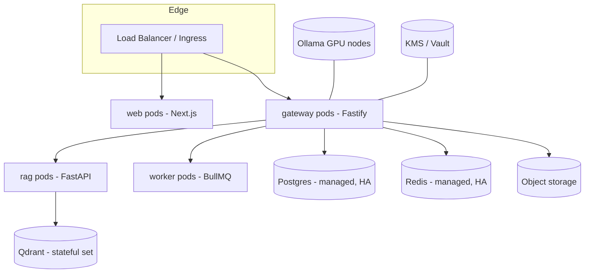

# 13 — Security, Deployment & Scaling

Covers original deliverables 11 (deployment), 12 (scaling), and 13 (security).

## Security

### Authentication & RBAC 
- **Auth:** Clerk issues sessions/JWTs; the gateway verifies on every request and resolves `(user, workspace, role, permissions)`.
- **RBAC:** roles are per-workspace (`roles.permissions jsonb`). Permission strings are `resource:action` (`agents:write`, `credentials:write`, `runs:approve`, `workflows:run`, `billing:read`). Default roles: **Owner**, **Admin**, **Operator** (run/approve, no secrets), **Viewer** (read-only). Every mutating route + every WS event delivery checks permission.
- **Workspace isolation:** `workspace_id` on every tenant row, enforced in the repository layer (optionally Postgres RLS). No cross-workspace reads; WS broadcaster re-checks tenant on each event.

### Secrets management 
- **Envelope encryption.** A master key in a KMS (AWS KMS / GCP KMS / Vault) encrypts per-workspace **data keys**; data keys encrypt provider/connector credentials. `provider_credentials.ciphertext` + `key_version` are stored; plaintext exists only in gateway memory at call time.
- **Write-only API.** Credentials are never returned to the client (masked previews only). Rotation bumps `key_version`; old versions decrypt-only until re-encrypted.
- **Connector auth** resolved at call time, never embedded in agent config or exposed to the model.
- **Secret scanning** in CI; no secrets in logs (redaction policy on tool args/results and structured logs).

### Tenant & runtime isolation
- MCP stdio connectors run as constrained child processes (scoped cwd, dropped env), optionally containerized; HTTP connectors restricted by an **egress allow-list** ([08](./08-mcp-integration.md#sandboxing--permissions)).
- Code nodes in workflows run in a sandbox (isolated VM / restricted worker), never the gateway process.

### Auditing & compliance
- `audit_logs` records security-relevant actions (credential CRUD, role changes, approvals, connector changes) with actor, target, IP, timestamp.
- HITL approvals are auditable (`tool_calls.approved_by`). Useful for the RWA Compliance agent flows.

### Application hardening
- Input validation via zod at every boundary (`packages/types`).
- Idempotency keys prevent duplicate mutations; CSRF protections on browser flows; strict CORS to the web origin; security headers.
- Prompt-injection posture: tools are allow-listed per agent + HITL-gated for side-effecting actions, so a hijacked agent still cannot exceed its granted, gated capabilities.

## Rate limiting 
Two layers, both Redis token-bucket:
- **Inbound** — per workspace + per route class (chat vs CRUD vs ingest), surfaced via `X-RateLimit-*` headers.
- **Outbound** — per provider credential, to respect vendor TPM/RPM limits; the router uses remaining budget as a routing signal and the circuit breaker trips on sustained 429s.

## Deployment 

- **Containers:** each app has a Dockerfile; `infra/docker` compose for local (pg, redis, qdrant, ollama).
- **Kubernetes-ready:** Helm chart in `infra/k8s` — Deployments for stateless services (web, gateway, workers, rag), StatefulSet for self-hosted Qdrant, managed Postgres/Redis preferred in cloud. HPA on CPU + custom metrics (queue depth, active runs).
- **Serverless-compatible:** `apps/web` deploys to Vercel; the gateway can run on a container platform (Fly/Render/ECS/Cloud Run). SSE/WS require a platform that supports long-lived connections (or a dedicated realtime tier).
- **Config:** 12-factor env vars; secrets from KMS/Vault, not env files in prod.
- **CI/CD:** Turborepo affected-graph builds → image build → migrate (`drizzle`) → rolling deploy. Migrations are backward-compatible (expand/contract) to allow zero-downtime rollouts.
- **Health:** `/v1/health` liveness/readiness; readiness gates on Postgres + Redis reachability.

## Scaling 
- **Stateless horizontal scale** for web/gateway/workers — add replicas behind the LB. Realtime fan-out works across replicas via the shared Redis Streams bus, so **no sticky sessions** are required for correctness ([09](./09-streaming-websockets.md)).
- **Work offloaded to queues** — long runs, workflow nodes, and RAG ingest execute in BullMQ workers, scaled independently from request handlers. Queue depth is an HPA signal.
- **Data tier:** Postgres read replicas for dashboards/rollups; `usage_events` partitioned by month or moved to TimescaleDB at high volume; Redis cluster for queues + pub/sub; Qdrant sharded/replicated.
- **Concurrency control:** per-workspace concurrency caps on active runs; provider-level limiter prevents thundering-herd against vendor APIs.
- **Cost optimization:** intelligent model routing (cheapest-that-qualifies), prompt caching where providers support it (`cachedTokens`), local Ollama for cheap/PII-sensitive work, response/embedding caching for repeated inputs, and budget guards that fail fast.
- **Resilience:** provider failover + circuit breakers ([05](./05-provider-abstraction.md#retry--resilience)); at-least-once durable workflows that survive worker restarts ([07](./07-orchestration-multiagent.md)); graceful degradation (if RAG is down, agents run without long-term recall and the UI flags it).
